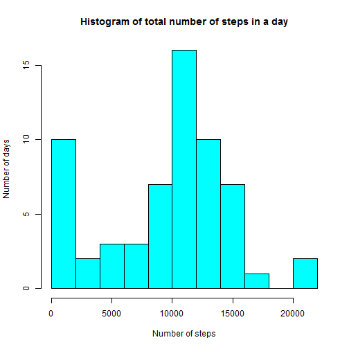
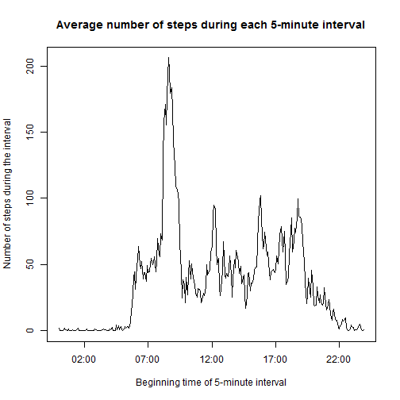
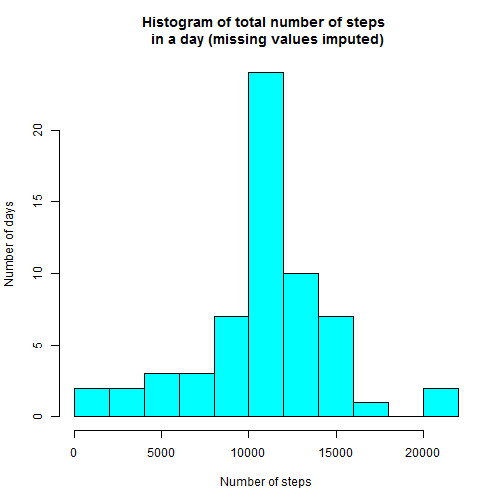
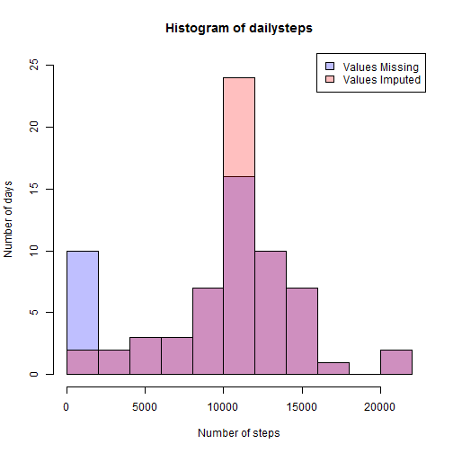
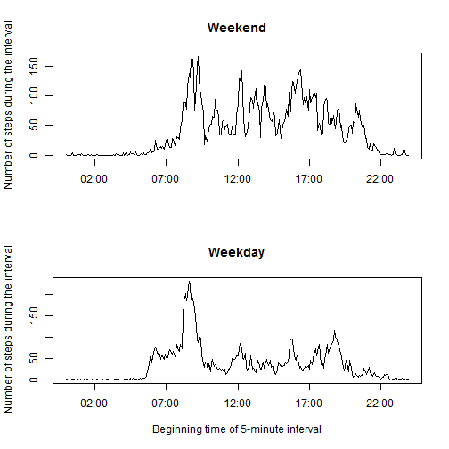

## Loading and preprocessing the data

As stated in this repository's README file, the dataset consists of 17,568 observations of three variables, which are:

* **steps**: Number of steps taken in a 5-minute interval (missing
    values are coded as `NA`)

* **date**: The date on which the measurement was taken in YYYY-MM-DD format

* **interval**: Identifier for the 5-minute interval in which measurement was taken. The identifier is the time of beginning of the interval formatted as 'hhmm' (24 hour clock). For example, interval 25 is the interval starting at 12:25am.

We load the data into a data.frame `act` and add two new variables:

* **datetime**: An object of class "POSIXlt" giving the time of the beginning of the 5-minute interval. This new variable will be used to give a meaningful scale to a time series plot in the following analysis.

* **daytype**: A factor variable stating whether the `date` is a weekday or weekend. Weekdays are coded as 0 and weekends are coded as 1.


```r
act <- read.csv("activity/activity.csv", stringsAsFactors = FALSE)
datetime <- paste(act$date, sprintf("%04d",act$interval))
act$datetime <- strptime(datetime, format = "%Y-%m-%d %H%M")
act$daytype <- factor(rep("Weekday", 17568), 
                      levels = c("Weekend", "Weekday"))
act$daytype[weekdays(act$datetime) %in% c("Saturday", "Sunday")] <- "Weekend"
head(act)
```

```
##   steps       date interval            datetime daytype
## 1    NA 2012-10-01        0 2012-10-01 00:00:00 Weekday
## 2    NA 2012-10-01        5 2012-10-01 00:05:00 Weekday
## 3    NA 2012-10-01       10 2012-10-01 00:10:00 Weekday
## 4    NA 2012-10-01       15 2012-10-01 00:15:00 Weekday
## 5    NA 2012-10-01       20 2012-10-01 00:20:00 Weekday
## 6    NA 2012-10-01       25 2012-10-01 00:25:00 Weekday
```

## What is the mean total number of steps taken per day?

We compute the total number of steps taken each day, ignoring
missing values, and plot these totals in a histogram.


```r
dailysteps <- tapply(act$steps, act$date, sum, na.rm = TRUE)
hist(dailysteps, col = "cyan", breaks = 10, 
     main = "Histogram of total number of steps in a day", 
     xlab = "Number of steps",
     ylab = "Number of days")
```

 

The mean and median of these daily totals are as follows.


```r
c(mean(dailysteps), median(dailysteps))
```

```
## [1]  9354.23 10395.00
```

The large difference between the mean and median is not surprising, given the visible skewness in the histogram.

## What is the average daily activity pattern?

Now we plot the number of steps taken during each 5-minute interval, averaged across all days. We're still ignoring missing values.


```r
intervalsteps <- tapply(act$steps, act$interval, mean, na.rm = TRUE)
plot(act$datetime[1:288], intervalsteps, type = "l",
     main = "Average number of steps during each 5-minute interval",
     xlab = "Beginning time of 5-minute interval",
     ylab = "Number of steps during the interval")
```

 

We find the 5-minute interval having the maximum number of steps on average. The first number shown in the output is the time at which the 5-minute interval begins, formatted as 'hhmm' using a 24 hour clock, dropping leading zeros. The second number is the index of this interval in a list containing all of the intervals in order.


```r
which.max(intervalsteps)
```

```
## 835 
## 104
```

## Imputing missing values

Now we consider the missing values. First we find how many observations are missing.


```r
colSums(is.na(act))
```

```
##    steps     date interval datetime  daytype 
##     2304        0        0        0        0
```

We can see that all the missing values are in the first column (the "steps" column), and there are 2304 of them.

Now we aim to impute the missing values. We shall replace a missing value corresponding to a 5-minute interval with the number of steps taken during that interval averaged across all days. We make this choice because of its simplicity and also because it seems likely to give a reasonably accurate estimate of the true values that are missing.


```r
missingindices <- which(is.na(act$steps))
act2 <- act
act2$steps[missingindices] <- rep(intervalsteps, 61)[missingindices]
```

Having filled in the missing data, the above histogram changes. 


```r
dailysteps2 <- tapply(act2$steps, act2$date, sum, na.rm = TRUE)
hist(dailysteps2, col = "cyan", breaks = 10, 
     main = "Histogram of total number of steps \n in a day (missing values imputed)", 
     xlab = "Number of steps",
     ylab = "Number of days")
```

 

The new mean and median are as follows.


```r
c(mean(dailysteps2), median(dailysteps2))
```

```
## [1] 10766.19 10766.19
```

We note that the mean and median are about equal, and higher than the mean and median before imputing the missing values.

We overlay the two histograms for comparison.


```r
missingcol <- rgb(0,0,1,1/4); imputedcol <- rgb(1,0,0,1/4)
hist(dailysteps, col = missingcol, breaks = 10, 
     xlab = "Number of steps",
     ylab = "Number of days", ylim = c(0, 25))
hist(dailysteps2, col = imputedcol, breaks = 10, 
     main = "Histogram of total number of steps in a day", 
     xlab = "Number of steps",
     ylab = "Number of days",
     add = TRUE)
legend('topright',c('Values Missing','Values Imputed'),
       fill = c(missingcol, imputedcol))
```

 

The only change between the two histograms is that the first bar, which was "too tall" because of the missing values, has been moved to the center of the histogram. This fixes the skewness in the data and raises both the mean and the median.

## Are there differences in activity patterns between weekdays and weekends?

Lastly, we plot the average daily activity patterns for weekends and weekdays separately for comparison.


```r
par(mfrow = c(2,1))
wknd <- act2[act2$daytype == "Weekend",]
wkdy <- act2[act2$daytype == "Weekday",]
wkndsteps <- tapply(wknd$steps, wknd$interval, mean, na.rm = TRUE)
wkdysteps <- tapply(wkdy$steps, wkdy$interval, mean, na.rm = TRUE)
plot(act$datetime[1:288], wkndsteps, type = "l",
     main = "Weekend",
     xlab = NA,
     ylab = "Number of steps during the interval")
plot(act$datetime[1:288], wkdysteps, type = "l",
     main = "Weekday",
     xlab = "Beginning time of 5-minute interval",
     ylab = "Number of steps during the interval")
```

 


